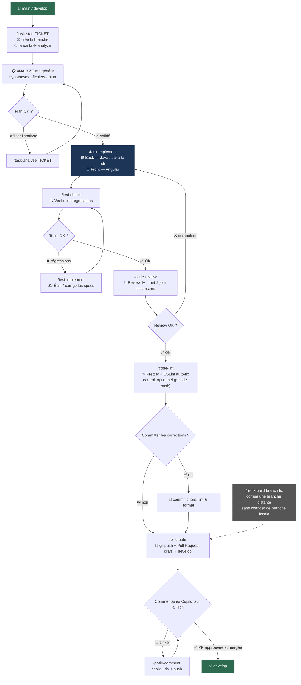

# presc-workflows-tools

Skills GitHub Copilot CLI pour le repo `orme-prescription` — automatisation du workflow de développement Angular (Jira, branches, implémentation, review, lint, PR).

## Prérequis

- [GitHub Copilot CLI](https://githubnext.com/projects/copilot-cli) installé
- `gh` CLI installé et authentifié (`gh auth login`)
- Variables d'environnement Jira dans `~/.bashrc` :
  - `JIRA_DOMAIN` (ex: `jira.dedalus.com`)
  - `JIRA_API_TOKEN` (Personal Access Token Jira)

## Installation

Avoir les deux repos dans le même dossier parent, puis depuis la racine de ce repo :

```bash
bash skills/setup.sh
```

Voir [SETUP.md](SETUP.md) pour les détails et la désinstallation.

## Catalogue des skills

| Skill              | Commande | Quand | Avantage                                                                   | Description                                                                                                                                   |
|--------------------|---|---|----------------------------------------------------------------------------|-----------------------------------------------------------------------------------------------------------------------------------------------|
| **task-start**     | `/task-start <TICKET>` | `main` / `develop` | Branche + analyse en une seule commande                                    | Crée la branche depuis un ticket Jira et lance l'analyse                                                                                      |
| **task-analyze**   | `/task-analyze <TICKET>` | n'importe quelle branche | Plan structuré avant de coder, évite les mauvaises pistes                  | Analyse un ticket Jira, investigue le code, génère un `ANALYZE.md`                                                                            |
| **task-implement** | `/task-implement` | branche de la tâche | Faire `/clear` avant — le contexte est dans `ANALYZE.md`                   | Implémente le code (🟠 Java/Jakarta EE back et/ou 🔵 Angular front) en s'appuyant sur les règles du projet et les leçons passées              |
| **test-check**     | `/test-check` | branche de la tâche | Détecte les régressions avant la PR, évite les surprises en CI             | Vérifie que les changements n'ont pas cassé de tests existants (🔵 Angular + 🟠 Java) — appelle `/test-implement` si des tests échouent       |
| **test-implement** | `/test-implement` | branche de la tâche | Génère le boilerplate des tests manquants automatiquement                  | Écrit et corrige les tests (🔵 specs Angular + 🟠 tests JUnit) pour les fichiers sans couverture et les tests en échec                        |
| **code-review**    | `/code-review` | branche de la tâche | Catch les erreurs avant la review humaine, enrichit `lessons.md`           | Review IA du diff (règles front + back + leçons passées)                                                                                      |
| **code-lint**      | `/code-lint` | branche de la tâche | Format + lint auto-fix, commit optionnel — jamais de push automatique      | Prettier + ESLint auto-fix sur les fichiers modifiés, puis propose un commit des corrections                                                  |
| **pr-create**      | `/pr-create` | branche de la tâche | Titre formaté `feat/fix(TICKET)`, label WORKFLOWS, body généré depuis Jira | Génère et crée la Pull Request GitHub (draft) vers `develop` avec le bon format de titre et le label WORKFLOWS                                |
| **pr-fix-comment** | `/pr-fix-comment` | branche de la tâche | Fix ciblé sans avoir à retrouver le contexte du commentaire                | Fixe un commentaire de review Copilot sur la PR courante                                                                                      |
| **pr-fix-build**   | `/pr-fix-build <branch> <fix>` | n'importe quelle branche | Corrige la branche d'une PR sans `git stash` ni `checkout`                 | Corrige le build d'une branche distante (format, lint, tests) sans changer de branche locale                                                  |
| **update-lib**     | `/update-lib [--bug BUG_ID] [--lib LIB_NAME] [--test]` | n'importe quelle branche | Met à jour une dépendance npm sur app+lib                                  | Met à jour une dépendance npm app/lib, en la spécifiant ou pas (liste proposée dans ce cas), peut lancer en suivant un npm start (avec --test) |

## Exemples d'utilisation

### `/task-start`
```
/task-start ORBIS-1234
```
> Crée la branche `presc/feature/ORBIS-1234` depuis `develop`, puis lance automatiquement `/task-analyze ORBIS-1234`.

---

### `/task-analyze`
```
/task-analyze ORBIS-1234
```
> Lit le ticket Jira, explore les fichiers impactés, propose des hypothèses d'implémentation et génère un `ANALYZE.md` local avec le plan de travail.

---

### `/task-implement`
```
/task-implement
```
> ⚠️ **Lancer `/clear` avant** pour démarrer avec un contexte propre — le contexte nécessaire est déjà dans `ANALYZE.md`.
>
> S'appuie sur le `ANALYZE.md` généré, les `front-rules`, `java-coding-style` et `lessons.md` pour implémenter les changements.

---

### `/test-check`
```
/test-check
```
> Détecte les specs impactées par les fichiers modifiés et les lance. Si des tests échouent, appelle automatiquement `/test-implement` pour les corriger.

---

### `/test-implement`
```
/test-implement
```
> Génère les specs manquantes pour les fichiers sans couverture, et corrige les specs en échec. Peut être appelé manuellement ou automatiquement par `/test-check`.

---

### `/code-review`
```
/code-review
```
> Analyse le diff `main...HEAD`, signale les violations des règles front/back et des leçons passées. Met à jour `lessons.md` si une nouvelle erreur bloquante est identifiée.
>
> **`lessons.md`** — fichier local qui accumule les erreurs récurrentes détectées lors des reviews précédentes. Il sert de mémoire long terme : chaque `/code-review` le consulte pour éviter de répéter les mêmes erreurs, et l'enrichit si une nouvelle erreur bloquante est identifiée.

---

### `/code-lint`
```
/code-lint
```
> Lance Prettier + ESLint auto-fix sur les fichiers modifiés. Si tout est propre, **demande si vous souhaitez committer** les corrections.

---

### `/pr-create`
```
/pr-create
```
> Génère le titre au format `feat(HORME-XXXX): ... /fixed` ou `fix(ORBISBUG-XXXX): ... /fixed` depuis le ticket Jira, génère le body depuis les changements effectués, applique le label **WORKFLOWS** et crée la PR en draft vers `develop`.

---

### `/pr-fix-comment`
```
/pr-fix-comment
```
> Liste les commentaires de review Copilot ouverts sur la PR, propose de choisir lequel fixer, applique le fix et push.

---

### `/pr-fix-build`
```
/pr-fix-build presc/feature/ORBIS-5678
/pr-fix-build presc/feature/ORBIS-5678 format
/pr-fix-build presc/feature/ORBIS-5678 tests
```
> Checkout la branche d'une PR dans un worktree temporaire, applique le fix demandé (`format`, `tests`, ou les deux si omis), commit et push — sans toucher à ta branche locale.

---

### `/update-lib`
```
/update-lib --bug ORBISBUG-135 --lib @medication-statement/lib --test
```
> Crée une branche, met à jour la version de @medication-statement/lib dans les package-lock.json de prescription-app et prescription-lib, crée le commit, lance npm install, vérifie que le proxy pointe bien sur FR et lance npm start
```
/update-lib --bug ORBISBUG-135
```
> Crée une branche, affiche la liste des dépendances existantes dans les package.json, permet d'en choisir une, met à jour la version de la lib choisie dans les package-lock.json de prescription-app et prescription-lib, crée le commit

## Workflow


> **Légende** : les nœuds en pointillés (grisés) sont des outils utilitaires utilisables à tout moment, hors du flux principal.
