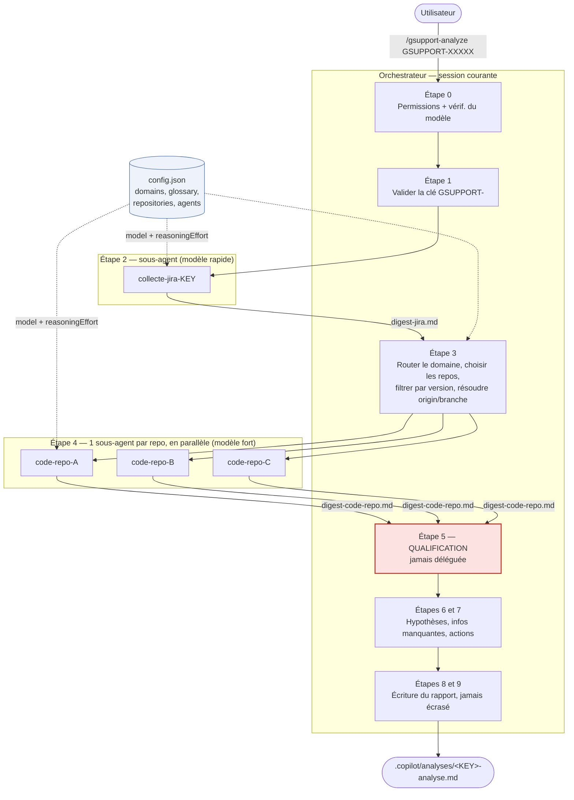
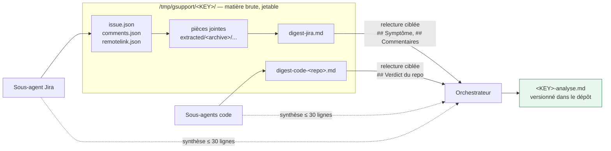
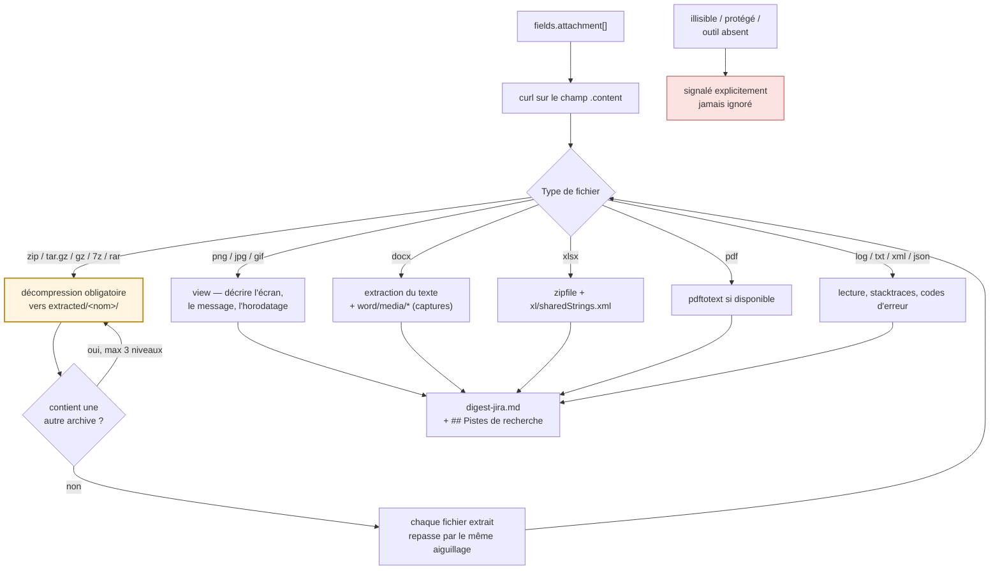
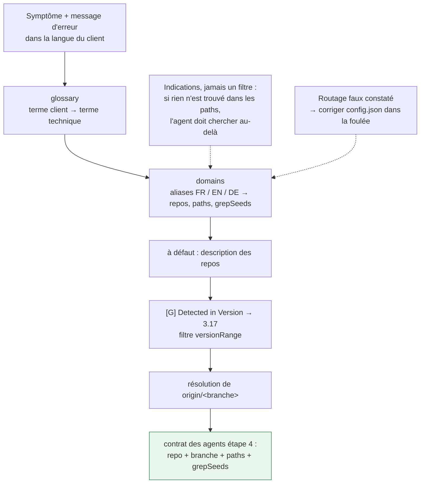
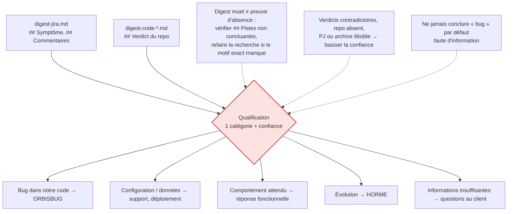

# gsupport-analyze — schéma de fonctionnement

Document destiné aux développeurs qui utilisent ou font évoluer le skill.
La référence normative reste `SKILL.md` ; ce fichier n'en est que la vue d'ensemble.

> **À maintenir avec le skill.** Toute modification du flux dans `SKILL.md` (étapes, répartition
> orchestrateur / sous-agents, fichiers produits, catégories de qualification, cas d'erreur) doit
> être répercutée ici dans le même commit. Voir la section « Maintenir la documentation
> d'architecture » de `SKILL.md` pour la correspondance changement → schéma.

## 1. Principe

Une analyse GSUPPORT brasse un gros volume brut (issue.json complet, dizaines de commentaires,
pièces jointes et archives, recherches de code sur plusieurs repos). Tout garder dans une seule
conversation sature le contexte avant l'étape qui a justement besoin de tout voir : la
qualification.

D'où la règle structurante du skill :

> **La collecte est déléguée à des sous-agents, la décision reste chez l'orchestrateur.**
> Chaque sous-agent écrit son résultat complet dans un fichier de `/tmp/gsupport/<KEY>/` et ne
> renvoie qu'une synthèse de 30 lignes maximum.

## 2. Vue d'ensemble

## 3. Qui fait quoi

| Bloc | Exécutant | Sortie |
|---|---|---|
| Étapes 0, 1 — permissions, modèle, validation de la clé | orchestrateur | — |
| Étape 2 — collecte Jira (ticket, commentaires, pièces jointes, archives, liens) | 1 sous-agent, `agents.jiraCollect` | `digest-jira.md` |
| Étape 3 — routage domaine, sélection des repos, résolution de branche | orchestrateur | tableau affiché |
| Étape 4 — investigation du code | 1 sous-agent par repo, en parallèle, `agents.codeInvestigate` | `digest-code-<repo>.md` |
| Étapes 5 à 9 — qualification, hypothèses, rapport | orchestrateur | `<KEY>-analyse.md` |

Ne se délègue **jamais** :

- toute question à l'utilisateur (`ask_user`) — un sous-agent ne sait pas dialoguer ;
- la qualification (étape 5), raison d'être du skill ;
- l'écriture du rapport final.

## 4. Passage par fichiers — ce qui protège vraiment le contexte

Un sous-agent qui recopie tout son travail dans sa réponse annule le bénéfice du découpage.
L'orchestrateur ne relit jamais un digest entier d'un coup, et jamais le JSON brut.

## 5. Étape 2 en détail — lecture exhaustive des pièces jointes

Le point le plus souvent sous-estimé : une pièce jointe non lue est une information manquante,
et une archive laissée fermée est un échec de l'étape.

La section `## Pistes de recherche` du digest (3 à 8 chaînes exactes : message d'erreur, libellé
d'écran, code, nom de bouton, classe d'une stacktrace) est le livrable le plus important de
l'étape 2 : c'est l'amorce des `git grep` de l'étape 4.

## 6. Étape 3 — du vocabulaire client au bon repo, sur la bonne branche

Deux invariants de l'étape 4 qui découlent d'ici :

- **lecture seule sur les références distantes** — `git grep`/`show`/`ls-tree`/`log` sur
  `origin/<branche>`. Aucun `checkout`, `switch`, `stash`, `worktree`, `reset` ni `pull` : la
  branche courante et le travail non commité de l'utilisateur restent intacts ;
- **ne jamais chercher dans les fichiers du disque** — ils sont sur une branche quelconque, ce
  serait une analyse du mauvais code, donc une qualification fausse.

## 7. Étape 5 — la seule étape qui décide

## 8. Reprise sur incident

| Situation | Comportement |
|---|---|
| Sous-agent en échec ou sortie vide | Ne pas le relancer : l'orchestrateur exécute le bloc lui-même et le signale dans le rapport |
| Modèle de `config.json` refusé | Relancer une fois sans le paramètre `model`, ne jamais bloquer l'analyse |
| Images non exploitables par le sous-agent | L'orchestrateur les regarde après coup, sans relancer tout le bloc |
| Archive non décompressable | `Archive non décompressée : <nom> — <raison>` dans le rapport |
| Rapport existant | Jamais écrasé : suffixe `-2`, `-3`… et mention de ce qui a changé |

## 9. Ce qu'il faut entretenir

`config.json` est la connaissance du skill, pas de la configuration figée. Il vieillit vite :

- `domains.aliases` — le vocabulaire réel des clients, en FR / EN / DE ;
- `glossary` — tout terme client rencontré et absent doit y être ajouté ;
- `domains.paths` et `grepSeeds` — à corriger dès qu'un chemin ne renvoie plus rien ;
- `repositories.versionRange` — à mettre à jour à chaque bascule de version ;
- `agents.*.model` — les identifiants de modèles évoluent, ils ne sont jamais en dur dans `SKILL.md`.

Une analyse qui révèle une lacune doit corriger `config.json` dans la foulée et le mentionner.
