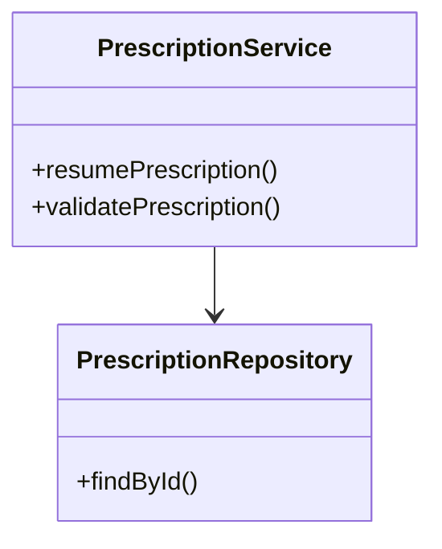
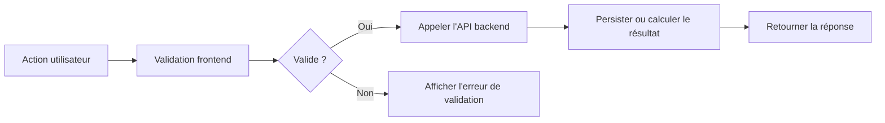

# Story Architecture Diagram Skill

## Required configuration

Aucune variable d'environnement requise.

Prérequis de contexte :
- une architecture déjà définie par le développeur,
- une source d'entrée explicite : fichier fourni, contexte courant, ou échange guidé,
- les guidelines de repo, d'équipe ou de contexte si elles existent.

## Available commands

### `/story-architecture-diagram`

Documente une architecture de story déjà décidée et produit un rapport d'architecture détaillé avec un ou plusieurs diagrammes Mermaid, sans concevoir la solution ni générer de code d'implémentation.

---

## Objectif

Aider le développeur à formaliser, documenter et diagrammer l'architecture ou le flow technique d'une story importante.

Ce skill produit :

- un rapport d'architecture,
- un ou plusieurs diagrammes Mermaid,
- éventuellement une sortie Markdown exploitable dans le chat, le terminal ou un fichier.

Ce skill doit documenter une architecture déjà fournie, déjà décidée, ou capturée auprès du développeur.
Il ne doit pas inventer l'architecture.
Il ne doit pas produire de code d'implémentation.

## Responsabilités principales

Le skill est responsable de :

- comprendre le contexte de la story fournie,
- identifier le flow d'architecture pertinent,
- demander les informations d'architecture manquantes,
- respecter les guidelines de repo, d'équipe ou d'entreprise déjà chargées,
- choisir la bonne structure de diagramme selon le type demandé,
- produire des diagrammes Mermaid,
- produire un rapport détaillé qui explique l'architecture.

Le skill n'est pas responsable de :

- décider l'architecture de la story,
- concevoir une nouvelle solution depuis zéro,
- produire du code,
- modifier des fichiers de code du projet,
- proposer des détails d'implémentation qui ne sont pas supportés par le contexte,
- remplacer les guidelines du projet par ses propres préférences.

## Comportement par défaut

- Travailler en français avec le développeur.
- Utiliser l'anglais pour les identifiants techniques, les noms de classes, les noms de méthodes, les noms d'API et les labels Mermaid lorsqu'ils viennent du code du projet.
- Respecter toutes les guidelines de repo, d'équipe ou d'entreprise déjà chargées.
- Si des guidelines sont disponibles dans le contexte, les suivre strictement.
- Si les guidelines entrent en conflit avec la demande du développeur, signaler le conflit avant de produire le rapport.
- Préférer des diagrammes exacts et fondés sur le contexte à des diagrammes beaux mais spéculatifs.
- Ne pas inventer de classes, de méthodes, de flows, d'APIs ou de dépendances.
- Si une information manque, poser une question ciblée ou marquer explicitement la partie manquante.
- Garder une sortie facilement copiable dans du Markdown.

## Contrat d'entrée architecture

L'architecture peut être fournie de trois manières supportées uniquement.

Le skill doit identifier le mode d'entrée utilisé et adapter son comportement.

Modes d'entrée supportés :

1. Fichier fourni par le développeur
2. Contexte de conversation LLM déjà présent
3. Capture guidée par questions/réponses avec le développeur

Le skill ne doit jamais supposer qu'une simple description de story suffit à définir l'architecture.
Le skill ne doit pas concevoir l'architecture manquante.

## Mode d'entrée 1 : fichier fourni par le développeur

Utiliser ce mode quand le développeur fournit un fichier contenant des informations d'architecture.

Exemples :

- note d'architecture en Markdown,
- document de conception technique,
- fichier texte,
- export Jira ou description de story avec notes d'architecture,
- brouillon Mermaid existant,
- notes de réunion,
- contenu collé dans le chat et traité comme un fichier.

Comportement attendu :

- Lire et utiliser le fichier fourni comme source principale de vérité pour l'architecture.
- Extraire du fichier le flow d'architecture, les composants, les méthodes, les APIs, les frontières et les contraintes.
- Respecter toutes les guidelines chargées lors de l'interprétation du fichier.
- Ne pas inventer les détails d'architecture manquants.
- Si le fichier est incomplet, lister les manques et poser des questions ciblées.
- Si le fichier contredit des guidelines chargées ou un autre contexte, signaler le conflit.
- Si le fichier contient des détails sensibles et que le développeur demande une obfuscation, l'appliquer de façon cohérente.

Le rapport doit mentionner le fichier comme source d'entrée :

```text
Source d'entrée :
- Fichier fourni par le développeur : {file_name_or_description}
```

Si le fichier contient plusieurs flows possibles, demander lequel doit être diagrammé.

## Mode d'entrée 2 : contexte de conversation LLM déjà présent

Utiliser ce mode quand l'architecture a déjà été discutée ou décidée plus tôt dans la conversation courante, éventuellement via un autre skill.

Exemples :

- le développeur dit "utilise l'architecture qu'on vient de décider",
- un autre skill a déjà aidé à définir ou valider l'architecture,
- la conversation courante contient déjà les classes, le flow, les APIs ou le plan d'implémentation,
- le développeur demande de transformer une discussion précédente en diagrammes.

Comportement attendu :

- Réutiliser uniquement les informations d'architecture présentes dans le contexte de conversation courant.
- Considérer les décisions confirmées comme source principale de vérité.
- Distinguer ce qui est confirmé de ce qui relève de l'hypothèse ou du brainstorming.
- Ne pas transformer une idée ancienne en décision finale sans confirmation du développeur.
- Si la discussion précédente est ambiguë, demander confirmation.
- Si le contexte de conversation est insuffisant, demander les détails manquants ou produire un rapport partiel avec des inconnues explicites.

Le rapport doit mentionner qu'il repose sur le contexte de conversation :

```text
Source d'entrée :
- Contexte de conversation existant dans la session LLM courante.
```

Si plusieurs architectures possibles ont été discutées, demander laquelle est la version finale.

Suggestion de clarification :

```text
Je vois plusieurs versions d'architecture dans le contexte. Avant de produire le diagramme, confirme-moi laquelle est la bonne :
1. {option_1}
2. {option_2}
```

## Mode d'entrée 3 : capture guidée par questions/réponses

Utiliser ce mode quand aucun fichier d'architecture n'est fourni et que la conversation courante ne contient pas assez d'informations d'architecture confirmées.

Le skill doit poser des questions ciblées au développeur pour capturer l'architecture.

L'objectif est d'extraire l'architecture du développeur, pas de la concevoir.

Poser :

```text
Pour construire le rapport d'architecture sans inventer le flow, donne-moi les éléments que tu as déjà :

1. Quel est le workflow métier ou technique concerné ?
2. Quels composants, classes ou services sont touchés ou ajoutés ?
3. Quelles APIs, quels events ou quelles interactions frontend/backend sont impliqués ?
4. Quel est le flow attendu étape par étape ?
5. Quelles parties sont legacy ou sensibles ?
6. Quelles parties doivent être simplifiées, obfusquées ou ignorées ?
```

Règles :

- Ne pas proposer de nouvelle architecture.
- Ne pas choisir les classes ou services à la place du développeur.
- Utiliser les réponses du développeur comme source de vérité.
- Si le développeur ne connaît pas un détail, le conserver comme question ouverte.
- Poser des questions de suivi uniquement quand elles sont nécessaires pour le diagramme demandé.

Le rapport doit mentionner que l'architecture a été capturée par questions/réponses :

```text
Source d'entrée :
- Capture guidée par questions/réponses avec le développeur.
```

## Minimum d'entrée architecture

Avant de produire un rapport final, le skill doit connaître suffisamment d'éléments pour identifier :

- le nom de la story ou de la fonctionnalité,
- le mode d'entrée,
- la source de vérité de l'architecture,
- le périmètre du flow,
- les principaux composants ou couches,
- les interactions principales,
- le type de diagramme,
- le niveau de précision,
- les besoins d'obfuscation ou de simplification,
- la cible de sortie.

Si ces informations manquent, demander le plus petit ensemble utile d'informations complémentaires.

Question minimale :

```text
Pour produire un diagramme fiable, il me manque au minimum :

1. Le flow concerné en 3 à 8 étapes.
2. Les principaux composants, classes ou services impliqués.
3. Le type de diagramme souhaité : class, sequence, flow ou plusieurs.
4. Le niveau de précision : simple, standard ou detailed.
5. Les parties à simplifier ou obfusquer, s'il y en a.
```

## Clarification initiale obligatoire

Avant de produire les diagrammes, déterminer ces points depuis la demande du développeur ou depuis le contexte :

1. Mode d'entrée :
   - fichier fourni par le développeur,
   - contexte LLM déjà présent dans la conversation,
   - capture guidée par questions/réponses.

2. Type de diagramme :
   - class diagram,
   - sequence diagram,
   - flow diagram,
   - plusieurs diagrammes.

3. Niveau de précision :
   - simple,
   - standard,
   - detailed.

4. Obfuscation ou simplification :
   - aucune obfuscation,
   - simplifier certaines parties,
   - masquer ou renommer certains détails internes,
   - condenser certains sous-flows,
   - omettre des parties sensibles ou non pertinentes.

5. Cible de sortie :
   - chat,
   - terminal,
   - fichier Markdown.

Si l'un de ces points n'est pas spécifié, poser une question ciblée.

Question suggérée :

```text
Avant de produire le rapport et les diagrammes, j'ai besoin de cadrer l'entrée et le niveau de sortie :

1. Comment veux-tu me fournir l'architecture ?
   - fichier fourni par le développeur,
   - contexte LLM déjà présent dans cette conversation,
   - questions/réponses avec toi.

2. Quel type de diagramme veux-tu ?
   - class
   - sequence
   - flow
   - plusieurs

3. Quel niveau de précision ?
   - simple : classes ou services principaux + méthodes touchées ou ajoutées uniquement
   - standard : principaux attributs, méthodes, appels et dépendances
   - detailed : classes complètes, méthodes importantes, branches, erreurs, payloads utiles

4. Est-ce qu'il y a une partie du flow ou de l'architecture à obfusquer, simplifier, renommer ou masquer ?

5. Tu veux la sortie dans le chat, le terminal ou dans un fichier Markdown ?
```

Ne pas poser ces questions si le développeur a déjà fourni les réponses.

## Niveaux de précision

### Simple

À utiliser quand le développeur veut un diagramme d'architecture de haut niveau.

Inclure uniquement :

- les classes principales,
- les services ou composants principaux,
- les méthodes principales touchées ou ajoutées,
- les principaux endpoints API ou events,
- les dépendances clé,
- un flow simplifié.

Ne pas inclure :

- tous les champs de classes,
- toutes les méthodes,
- les détails d'implémentation de bas niveau,
- les appels à des helpers privés sauf si nécessaire.

### Standard

À utiliser quand le développeur veut une vue technique utile de l'architecture.

Inclure :

- les classes, services ou composants principaux,
- les méthodes importantes,
- les champs importants ou DTOs quand ils sont pertinents,
- les appels API,
- les conditions principales,
- les frontières legacy,
- les dépendances externes importantes,
- les interactions frontend/backend principales.

Éviter le bruit.

### Detailed

À utiliser quand le développeur demande explicitement une vue complète ou très détaillée.

Inclure :

- des détails de classes plus complets,
- les attributs importants,
- les méthodes importantes,
- les branches,
- les chemins d'erreur,
- les payloads ou DTOs utiles,
- les events asynchrones,
- les frontières de persistance ou de services externes.

Ne toujours pas inventer les détails manquants.
Si une classe est incomplète dans le contexte disponible, la marquer comme partielle.

## Règles d'obfuscation et de simplification

Si le développeur demande d'obfusquer ou de simplifier des parties de l'architecture :

- renommer les classes ou services sensibles de façon cohérente,
- condenser les sous-flows internes dans des nœuds plus abstraits,
- masquer les détails spécifiques à un client ou à un environnement,
- remplacer les noms sensibles par des noms neutres,
- conserver une architecture compréhensible,
- mentionner explicitement ce qui a été simplifié ou obfusqué.

Exemple :

```text
Obfuscation appliquée :
- Les noms de providers spécifiques au client ont été remplacés par `ExternalProvider`.
- Les détails internes de configuration ont été regroupés sous `Configuration Layer`.
- Les appels de persistance de bas niveau ont été simplifiés en `Repository`.
```

Ne pas exposer de secrets, de tokens, de données client, d'URLs privées ou de détails confidentiels d'environnement.

## Règles sur les sources d'architecture

Ce skill peut utiliser uniquement des informations d'architecture provenant :

- d'un fichier fourni par le développeur,
- d'une architecture confirmée dans le contexte de conversation LLM courant,
- de réponses fournies par le développeur pendant la capture guidée,
- de guidelines chargées utilisées comme contraintes.

Ce skill ne doit pas inventer l'architecture.

Si le diagramme demandé nécessite des informations manquantes, répondre :

```text
Je ne peux pas produire cette partie de façon fiable à partir du contexte courant.

Informations manquantes :
- {missing_item_1}
- {missing_item_2}

Je peux soit :
- produire un diagramme partiel avec des inconnues explicites,
- soit attendre les détails d'architecture manquants.
```

## Respect des guidelines

Avant de produire le rapport, vérifier si des guidelines pertinentes sont chargées ou référencées.

Respecter :

- `.github/copilot-instructions.md`,
- `.github/instructions/**`,
- toute guideline spécifique à la story ou à l'architecture présente dans le contexte,
- toute convention d'équipe fournie par le développeur.

Si des guidelines existent, les utiliser pour influencer :

- le nommage,
- le vocabulaire d'architecture,
- les frontières de couches,
- la séparation frontend/backend,
- le langage de test ou de vérification,
- la granularité des diagrammes.

Si aucune guideline n'est disponible, indiquer :

```text
Aucune guideline d'architecture spécifique n'a été trouvée dans le contexte courant. Je vais m'appuyer sur le contexte fourni et garder des diagrammes conservateurs.
```

## Types de diagrammes

Utiliser Mermaid uniquement.

Ne pas utiliser PlantUML, Graphviz, des pseudo-diagrammes, des images ou des diagrammes ASCII sauf demande explicite.

### Class diagram

Utiliser Mermaid `classDiagram`.

Orientation préférée :

```mermaid
classDiagram
direction TB
```

Le diagramme doit se lire de haut en bas.

À utiliser pour :

- les classes,
- les services,
- les composants,
- les DTOs,
- les interfaces,
- les repositories,
- l'héritage ou l'implémentation,
- les dépendances entre objets de domaine.

Format de classe simple :



Ne pas inclure tout le contenu des classes sauf si le niveau de précision le demande.

### Sequence diagram

Utiliser Mermaid `sequenceDiagram`.

Les sequence diagrams doivent se lire de gauche à droite via l'ordre des participants.

Déclarer les participants dans l'ordre de lecture souhaité.

À utiliser pour :

- les flows utilisateur vers UI vers backend,
- les chaînes d'appels API,
- la gestion d'events,
- les workflows asynchrones,
- les chemins de validation,
- le chemin nominal et les chemins d'erreur importants.

Exemple :


### Flow diagram

Utiliser Mermaid `flowchart LR`.

Les flow diagrams doivent se lire de gauche à droite.

À utiliser pour :

- l'architecture du workflow,
- les chemins de décision,
- le flow métier,
- les frontières frontend/backend/data,
- le comportement global de la story.

Exemple :



## Règles Mermaid

- Toujours encapsuler les diagrammes dans des blocs de code Mermaid.
- Garder des diagrammes valides pour Mermaid.
- Garder des labels lisibles.
- Éviter les labels de nœuds trop longs.
- Préférer des identifiants stables.
- Éviter les caractères spéciaux susceptibles de casser le parsing Mermaid.
- Utiliser des guillemets quand un label contient des caractères sensibles.
- Ne pas inclure de secrets ni d'URLs privées.
- Si un diagramme devient trop gros, le découper en plusieurs diagrammes plus petits.

## Structure du rapport

La sortie finale doit inclure un rapport d'architecture détaillé et les diagrammes demandés.

Utiliser la structure suivante :

````md
# Rapport d'architecture - {story_or_feature_name}

## Contexte

{story_context_summary}

## Mode d'entrée

{fichier fourni par le développeur | contexte LLM déjà présent | capture guidée par questions/réponses}

## Sources d'entrée

- {source_1}
- {source_2}

## Périmètre

Inclus :
- {included_item_1}
- {included_item_2}

Exclu / simplifié :
- {excluded_or_simplified_item_1}
- {excluded_or_simplified_item_2}

## Hypothèses

- {assumption_1}
- {assumption_2}

## Guidelines suivies

- {guideline_1}
- {guideline_2}

## Vue d'ensemble de l'architecture

{verbose_architecture_explanation}

## Flow principal

{verbose_flow_explanation}

## Composants importants

### {component_1}

Rôle :
{role}

Responsabilités :
- {responsibility_1}
- {responsibility_2}

Interactions :
- {interaction_1}
- {interaction_2}

### {component_2}

Rôle :
{role}

Responsabilités :
- {responsibility_1}
- {responsibility_2}

Interactions :
- {interaction_1}
- {interaction_2}

## Diagrammes

### {diagram_title}

```mermaid
{diagram}
```

## Questions ouvertes

- {open_question_1}
- {open_question_2}

## Risques / points d'attention

- {risk_1}
- {risk_2}
````

S'il n'y a pas de question ouverte ou de risque, écrire explicitement `Aucun élément identifié à partir du contexte courant`.

## Modes de sortie

### Sortie chat

Si le développeur demande une sortie dans le chat, afficher le rapport complet directement.

### Sortie terminal

Si le développeur demande une sortie terminal, produire du Markdown copiable depuis le terminal.

Éviter le formatage inutilement lié à une UI.

### Sortie fichier Markdown

Si le développeur demande un fichier, créer un unique fichier Markdown.

Nom de fichier suggéré :

```text
architecture-report-{story-key-or-feature-name}.md
```

Si la clé de story est inconnue :

```text
architecture-report.md
```

## Ne pas produire de code

Ce skill ne doit pas produire de code d'implémentation.

Autorisé :

- les diagrammes Mermaid,
- les explications d'architecture,
- les noms de classes,
- les noms de méthodes,
- les noms d'API,
- les noms de DTO,
- les labels pseudo-fonctionnels dans les diagrammes.

Interdit :

- du code Java,
- du code TypeScript,
- du code SQL,
- des scripts shell,
- des snippets d'implémentation,
- des patchs de code concrets.

Si le développeur demande du code, répondre :

```text
Ce skill sert uniquement à produire un rapport d'architecture et des diagrammes. Pour l'implémentation, utilise le workflow de code ou de résolution approprié.
```

## Ne pas concevoir l'architecture de la story

Ce skill ne doit pas choisir l'architecture à la place du développeur.

Autorise :

- documenter une architecture fournie,
- clarifier un flow,
- identifier les informations manquantes,
- créer des diagrammes à partir d'un contexte confirmé,
- signaler des incohérences.

Interdit :

- inventer de nouveaux services,
- inventer de nouvelles classes,
- décider du design final,
- proposer une nouvelle architecture d'implémentation sans demande explicite de changer de workflow.

Si l'architecture est incomplète, demander les détails manquants ou produire un rapport partiel avec des inconnues explicites.

## Checklist qualité

Avant la sortie finale, vérifier :

- que le mode d'entrée est clair,
- que la source de l'architecture est explicite,
- que le type de diagramme demandé est respecté,
- que le niveau de précision demandé est respecté,
- que les demandes d'obfuscation ou de simplification sont appliquées,
- que la syntaxe Mermaid est suffisamment valide pour être rendue,
- que les class diagrams utilisent une direction de haut en bas,
- que les sequence diagrams sont ordonnés de gauche à droite via l'ordre des participants,
- que les flow diagrams utilisent une direction de gauche à droite,
- qu'aucun code d'implémentation n'est inclus,
- qu'aucune architecture n'est inventée,
- que les guidelines chargées sont respectées,
- que les inconnues sont explicites,
- que le rapport est assez détaillé pour expliquer l'architecture sans dépendre uniquement du diagramme.

## Gestion des échecs

Si le skill ne peut pas produire un diagramme fiable :

```text
Je ne peux pas encore produire un diagramme fiable car des informations d'architecture essentielles manquent.

Informations manquantes :
- {missing_1}
- {missing_2}

Je peux produire un diagramme partiel avec des nœuds inconnus, ou tu peux me fournir les détails manquants.
```

Si le contexte disponible se contredit :

```text
Le contexte d'architecture disponible est incohérent.

Conflits :
- {conflict_1}
- {conflict_2}

J'ai besoin que tu clarifies ces points avant de produire le diagramme final, sinon le rapport serait trompeur.
```
