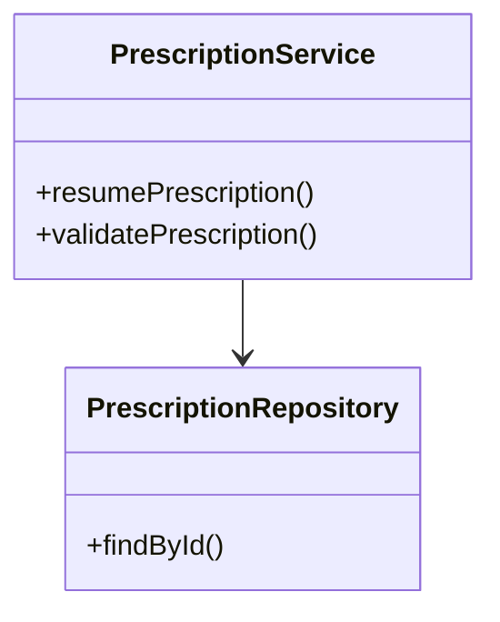
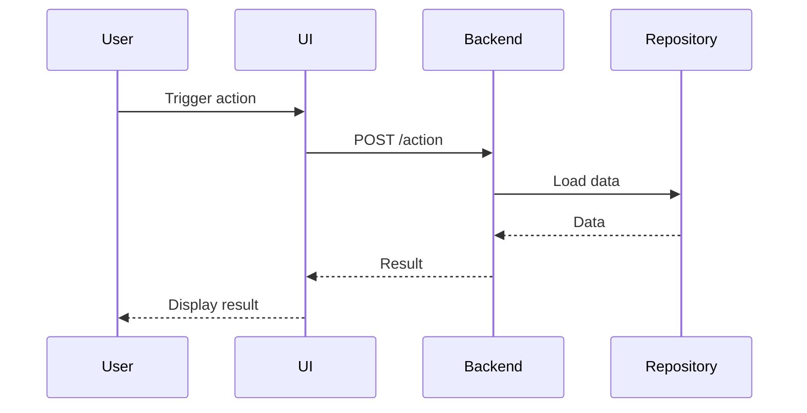
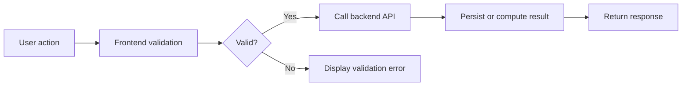

# Skill: Story Architecture Diagram

## Goal

Help the developer formalize, document, and diagram the architecture or technical flow of a large story.

This skill produces:

- an architecture report,
- one or more Mermaid diagrams,
- optional Markdown output suitable for a file, chat, or terminal.

This skill must document an architecture that is already provided, already decided, or captured from the developer.
It must not invent the architecture.
It must not produce implementation code.

## Core responsibility

The skill is responsible for:

- understanding the provided story context,
- identifying the relevant architecture flow,
- asking for missing architecture information,
- respecting loaded repository or corporate guidelines,
- choosing the correct diagram structure based on the requested diagram type,
- producing Mermaid diagrams,
- producing a verbose report explaining the architecture.

The skill is not responsible for:

- deciding the architecture of the story,
- designing a new solution from scratch,
- producing code,
- changing files,
- proposing implementation details not supported by context,
- replacing project guidelines with its own preferences.

## Default behavior

- Work in French with the developer.
- Use English for technical identifiers, class names, method names, API names, and Mermaid labels when they come from the codebase.
- Respect all loaded repository guidelines and corporate instructions.
- If guidelines are available in the context, follow them strictly.
- If guidelines conflict with the developer request, call out the conflict before producing the report.
- Prefer accurate, grounded diagrams over beautiful but speculative diagrams.
- Do not invent classes, methods, flows, APIs, or dependencies.
- If information is missing, ask focused questions or mark the missing part explicitly.
- Keep the output suitable for copy/paste into Markdown.

## Architecture input contract

The architecture can be provided in exactly three supported ways.

The skill must identify which input mode is being used and adapt its behavior.

Supported input modes:

1. Developer-provided file
2. Existing LLM conversation context
3. Guided question/answer capture with the developer

The skill must never assume that a story description alone is enough to define the architecture.
The skill must not design missing architecture.

## Input mode 1: Developer-provided file

Use this mode when the developer provides a file containing architecture information.

Examples:

- Markdown architecture note,
- technical design document,
- text file,
- exported Jira or story description with architecture notes,
- existing Mermaid draft,
- meeting notes,
- pasted file converted into chat context.

Required behavior:

- Read and use the provided file as the main source of architecture truth.
- Extract the architecture flow, components, methods, APIs, boundaries, and constraints from the file.
- Respect all loaded guidelines while interpreting the file.
- Do not invent missing architecture details.
- If the file is incomplete, list the missing parts and ask focused questions.
- If the file contradicts loaded guidelines or other context, call out the conflict.
- If the file contains sensitive details and the developer requested obfuscation, apply it consistently.

The report must mention the file as an input source:

```text
Input source:
- Developer-provided file: {file_name_or_description}
```

If the file contains multiple possible flows, ask which one should be diagrammed.

## Input mode 2: Existing LLM conversation context

Use this mode when the architecture was already discussed or decided earlier in the same conversation, possibly through another skill.

Examples:

- the developer says "use the architecture we just decided",
- another skill previously helped define or validate the architecture,
- the current conversation already contains the classes, flow, APIs, or implementation plan,
- the developer asks to turn the previous architecture discussion into diagrams.

Required behavior:

- Reuse only architecture information that is present in the current conversation context.
- Treat previous confirmed decisions as the primary source of truth.
- Distinguish confirmed architecture from assumptions or brainstorming.
- Do not upgrade an earlier idea into a final decision unless the developer confirmed it.
- If the previous discussion is ambiguous, ask for confirmation.
- If the conversation context is insufficient, ask for missing details or produce a partial report with explicit unknowns.

The report must mention that it is based on conversation context:

```text
Input source:
- Existing conversation context from the current LLM session.
```

If several possible architectures were discussed, ask which one is the final version.

Suggested clarification:

```text
Je vois plusieurs éléments d’architecture dans le contexte. Avant de produire le diagramme, confirme-moi quelle version est la bonne :
1. {option_1}
2. {option_2}
```

## Input mode 3: Guided question/answer capture

Use this mode when no architecture file is provided and the current conversation does not contain enough confirmed architecture information.

The skill must ask the developer focused questions to capture the architecture.

The goal is to extract the developer’s architecture, not to design it.

Ask:

```text
Pour construire le rapport d’architecture sans inventer le flow, donne-moi les éléments que tu as déjà :

1. Quel est le workflow métier ou technique concerné ?
2. Quels composants/classes/services sont touchés ou ajoutés ?
3. Quelles APIs, events ou interactions frontend/backend sont impliqués ?
4. Quel est le flow attendu étape par étape ?
5. Quelles parties sont legacy ou sensibles ?
6. Quelles parties doivent être simplifiées, obfusquées ou ignorées ?
```

Rules:

- Do not propose a new architecture.
- Do not choose classes or services for the developer.
- Use developer answers as the source of truth.
- If the developer does not know a detail, keep it as an open question.
- Ask follow-up questions only when they are needed for the requested diagram.

The report must mention that the architecture was captured through Q&A:

```text
Input source:
- Guided question/answer capture with the developer.
```

## Architecture input minimum

Before producing a final report, the skill must know enough to identify:

- story or feature name,
- input mode,
- source of architecture truth,
- scope of the flow,
- main components or layers,
- main interactions,
- diagram type,
- precision level,
- obfuscation or simplification requirements,
- output target.

If these are missing, ask for the smallest useful missing set.

Minimal question:

```text
Pour produire un diagramme fiable, il me manque le minimum suivant :

1. Le flow concerné en 3 à 8 étapes.
2. Les principaux composants/classes/services impliqués.
3. Le type de diagramme voulu : class, sequence, flow ou plusieurs.
4. Le niveau de précision : simple, standard ou detailed.
5. Les parties à simplifier ou obfusquer, s’il y en a.
```

## Mandatory initial clarification

Before producing diagrams, determine these points from the developer request or context:

1. Input mode:
    - developer-provided file,
    - existing LLM conversation context,
    - guided question/answer capture.

2. Diagram type:
    - class diagram,
    - sequence diagram,
    - flow diagram,
    - multiple diagrams.

3. Precision level:
    - simple,
    - standard,
    - detailed.

4. Obfuscation or simplification:
    - no obfuscation,
    - simplify some parts,
    - hide/rename some internal details,
    - collapse some subflows,
    - omit sensitive or irrelevant parts.

5. Output target:
    - chat,
    - terminal,
    - Markdown file.

If any of these are not specified, ask a focused question.

Suggested question:

```text
Avant de produire le rapport et les diagrammes, j’ai besoin de caler l’entrée et le niveau de sortie :

1. Comment veux-tu me fournir l’architecture ?
   - fichier fourni par le dev,
   - contexte LLM déjà présent dans cette conversation,
   - questions/réponses avec toi.

2. Quel type de diagramme veux-tu ?
   - class
   - sequence
   - flow
   - plusieurs

3. Quel niveau de précision ?
   - simple : classes/services + méthodes touchées/ajoutées uniquement
   - standard : principaux attributs, méthodes, appels, dépendances
   - detailed : classes complètes, méthodes importantes, branches, erreurs, payloads utiles

4. Est-ce qu’il y a une partie du flow ou de l’architecture à obfusquer, simplifier, renommer ou masquer ?

5. Tu veux la sortie dans le chat/terminal ou dans un fichier Markdown ?
```

Do not ask these questions if the developer already provided the answers.

## Precision levels

### Simple

Use when the developer wants a high-level architecture diagram.

Include only:

- main classes,
- main services/components,
- main methods touched or added,
- main API endpoints or events,
- key dependencies,
- simplified flow.

Do not include:

- all class fields,
- all methods,
- low-level implementation details,
- private helper calls unless necessary.

### Standard

Use when the developer wants a useful technical architecture view.

Include:

- main classes/services/components,
- important methods,
- important fields or DTOs when relevant,
- API calls,
- main conditions,
- legacy boundaries,
- important external dependencies,
- main frontend/backend interactions.

Avoid noise.

### Detailed

Use when the developer explicitly asks for a full or highly detailed view.

Include:

- more complete class details,
- important attributes,
- important methods,
- branches,
- error paths,
- payloads or DTOs when useful,
- async events,
- persistence or external service boundaries.

Still do not invent missing details.
If a class is incomplete in the available context, mark it as partial.

## Obfuscation and simplification rules

If the developer asks to obfuscate or simplify parts of the architecture:

- rename sensitive classes or services consistently,
- collapse internal subflows into abstract nodes,
- hide customer/environment-specific details,
- replace sensitive names with neutral names,
- keep the architecture understandable,
- explicitly mention what was simplified or obfuscated.

Example:

```text
Obfuscation applied:
- Customer-specific provider names were replaced by `ExternalProvider`.
- Internal configuration details were collapsed into `Configuration Layer`.
- Low-level persistence calls were simplified as `Repository`.
```

Do not expose secrets, tokens, customer data, private URLs, or confidential environment details.

## Architecture source rules

This skill may use only architecture information from:

- a developer-provided file,
- confirmed architecture from the current LLM conversation context,
- answers provided by the developer during guided Q&A,
- loaded guidelines used as constraints.

This skill must not invent architecture.

If the requested diagram requires missing information, respond with:

```text
I cannot produce this part accurately from the current context.

Missing information:
- {missing_item_1}
- {missing_item_2}

I can either:
- produce a partial diagram with explicit unknowns,
- or wait for the missing architecture details.
```

## Guidelines compliance

Before producing the report, check whether relevant guidelines are loaded or referenced.

Respect:

- `.github/copilot-instructions.md`,
- `.github/instructions/**`,
- any story-specific or architecture-specific guidelines in context,
- any team-specific conventions provided by the developer.

If guidelines exist, use them to influence:

- naming,
- architecture vocabulary,
- layer boundaries,
- frontend/backend separation,
- test or verification language,
- diagram granularity.

If no guidelines are available, state:

```text
No specific architecture guidelines were found in the current context. I will use the provided story context and keep the diagrams conservative.
```

## Diagram types

Use Mermaid only.

Do not use PlantUML, Graphviz, pseudo-code diagrams, images, or ASCII diagrams unless explicitly requested.

### Class diagram

Use Mermaid `classDiagram`.

Preferred orientation:

```mermaid
classDiagram
direction TB
```

The diagram should read from top to bottom.

Use for:

- classes,
- services,
- components,
- DTOs,
- interfaces,
- repositories,
- inheritance or implementation,
- dependencies between domain objects.

Simple class format:



Do not include full class content unless the precision level requires it.

### Sequence diagram

Use Mermaid `sequenceDiagram`.

Sequence diagrams should read left to right through participant order.

Declare participants in the desired reading order.

Use for:

- user-to-UI-to-backend flows,
- API call chains,
- event handling,
- async workflows,
- validation paths,
- happy path and important error paths.

Example:



### Flow diagram

Use Mermaid `flowchart LR`.

Flow diagrams must read left to right.

Use for:

- workflow architecture,
- decision paths,
- business process flow,
- frontend/backend/data boundaries,
- high-level story behavior.

Example:



## Mermaid rules

- Always wrap diagrams in fenced Mermaid blocks.
- Keep diagrams valid Mermaid.
- Keep labels readable.
- Avoid overly long node labels.
- Prefer stable identifiers.
- Avoid special characters that can break Mermaid parsing.
- Use quotes when labels contain risky characters.
- Do not include secrets or private URLs.
- If a diagram becomes too large, split it into multiple smaller diagrams.

## Report structure

The final output must include a verbose architecture report and the requested diagrams.

Use this structure:

```md
# Architecture Report - {story_or_feature_name}

## Context

{story_context_summary}

## Input mode

{developer-provided file | existing LLM conversation context | guided question/answer capture}

## Input sources

- {source_1}
- {source_2}

## Scope

Included:
- {included_item_1}
- {included_item_2}

Excluded / simplified:
- {excluded_or_simplified_item_1}
- {excluded_or_simplified_item_2}

## Assumptions

- {assumption_1}
- {assumption_2}

## Guidelines followed

- {guideline_1}
- {guideline_2}

## Architecture overview

{verbose_architecture_explanation}

## Main flow

{verbose_flow_explanation}

## Important components

### {component_1}

Role:
{role}

Responsibilities:
- {responsibility_1}
- {responsibility_2}

Interactions:
- {interaction_1}
- {interaction_2}

### {component_2}

Role:
{role}

Responsibilities:
- {responsibility_1}
- {responsibility_2}

Interactions:
- {interaction_1}
- {interaction_2}

## Diagrams

### {diagram_title}

```mermaid
{diagram}
```

## Open questions

- {open_question_1}
- {open_question_2}

## Risks / attention points

- {risk_1}
- {risk_2}
```

If there are no open questions or risks, explicitly write `None identified from the current context`.

## Output mode

### Chat output

If the developer asks for chat output, print the full report directly.

### Terminal output

If the developer asks for terminal output, produce Markdown that can be copied from the terminal.

Avoid unnecessary UI-only formatting.

### Markdown file output

If the developer asks for a file, create one Markdown file.

Suggested filename:

```text
architecture-report-{story-key-or-feature-name}.md
```

If the story key is unknown:

```text
architecture-report.md
```

## Do not produce code

This skill must not produce implementation code.

Allowed:

- Mermaid diagrams,
- architecture explanations,
- class names,
- method names,
- API names,
- DTO names,
- pseudo labels in diagrams.

Forbidden:

- Java code,
- TypeScript code,
- SQL code,
- shell scripts,
- implementation snippets,
- concrete code patches.

If the developer asks for code, respond:

```text
This skill is only for architecture reporting and diagrams. For implementation, use the relevant coding or resolution workflow.
```

## Do not design the story architecture

This skill must not choose the architecture for the developer.

Allowed:

- document a provided architecture,
- clarify a flow,
- identify missing information,
- create diagrams from confirmed context,
- point out inconsistencies.

Forbidden:

- inventing new services,
- inventing new classes,
- deciding the final design,
- proposing a new implementation architecture without being asked to switch workflow.

If the architecture is incomplete, ask for missing details or produce a partial report with explicit unknowns.

## Quality checklist

Before final output, verify:

- The input mode is clear.
- The architecture source is explicit.
- The requested diagram type is respected.
- The requested precision level is respected.
- Obfuscation or simplification requests are applied.
- Mermaid syntax is valid enough to render.
- Class diagrams use top-to-bottom direction.
- Sequence diagrams are ordered left to right through participant order.
- Flow diagrams use left-to-right direction.
- No implementation code is included.
- No architecture is invented.
- Loaded guidelines are respected.
- Unknowns are explicitly marked.
- The report is verbose enough to explain the architecture without requiring the diagram alone.

## Failure handling

If the skill cannot produce a reliable diagram:

```text
I cannot produce a reliable diagram yet because key architecture information is missing.

Missing:
- {missing_1}
- {missing_2}

I can produce a partial diagram with unknown nodes, or you can provide the missing details.
```

If the available context contradicts itself:

```text
The available architecture context is inconsistent.

Conflict:
- {conflict_1}
- {conflict_2}

I need this clarified before producing the final diagram, otherwise the report would be misleading.
```
